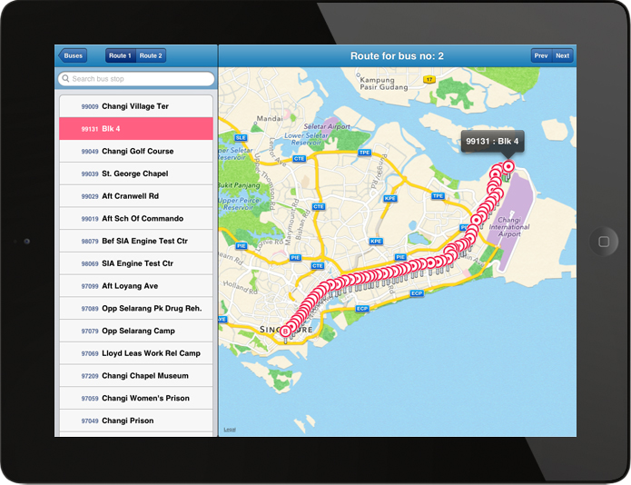

### SGBusRouter

This iPad app is an iOS port of [@cheeaun](https://github.com/cheeaun)'s [busrouter-sg](https://github.com/cheeaun/busrouter-sg). It basically shows all routes on the map for all bus services in Singapore. Credits to [@cheeaun](https://github.com/cheeaun)!

The app used to be in the AppStore for a while until 2015 when my App Developer Program expires. The source code is in this repository and the bus data is outdated.

## Original Implementation

Refer to following links for its original implementation:
- [https://busrouter.sg/](https://busrouter.sg/)
- [https://github.com/cheeaun/busrouter-sg](https://github.com/cheeaun/busrouter-sg)

Library dependency: **AFNetworking**
