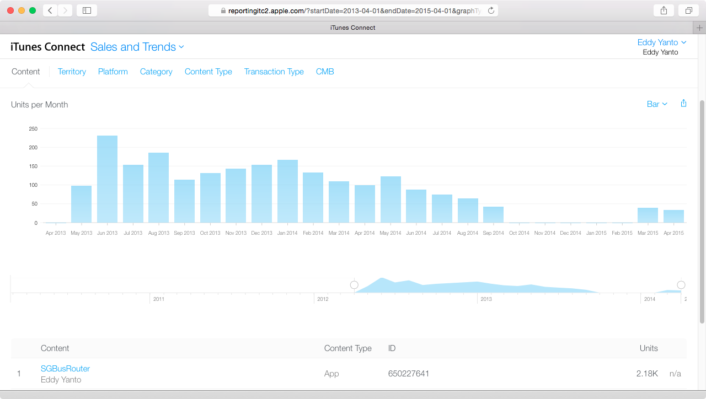

## SGBusRouter

This iPad app is a conceptual port of cheeaun's [busrouter-sg](https://github.com/cheeaun/busrouter-sg). Like its original version, it basically show all available routes on the map for all bus services in Singapore. Credits to [@cheeaun](https://github.com/cheeaun)!

The app used to be in the AppStore for a while up until mid 2015 when my app develope program expired. The Xcode project is in this repository and the bus data is outdated.

## Itunes Connect

There were around 2k+ download over a period of 2 years.

## Original Web-Based Implementation

- [https://busrouter.sg/](https://busrouter.sg/)
- [https://github.com/cheeaun/busrouter-sg](https://github.com/cheeaun/busrouter-sg)

## Library dependency:
**AFNetworking**